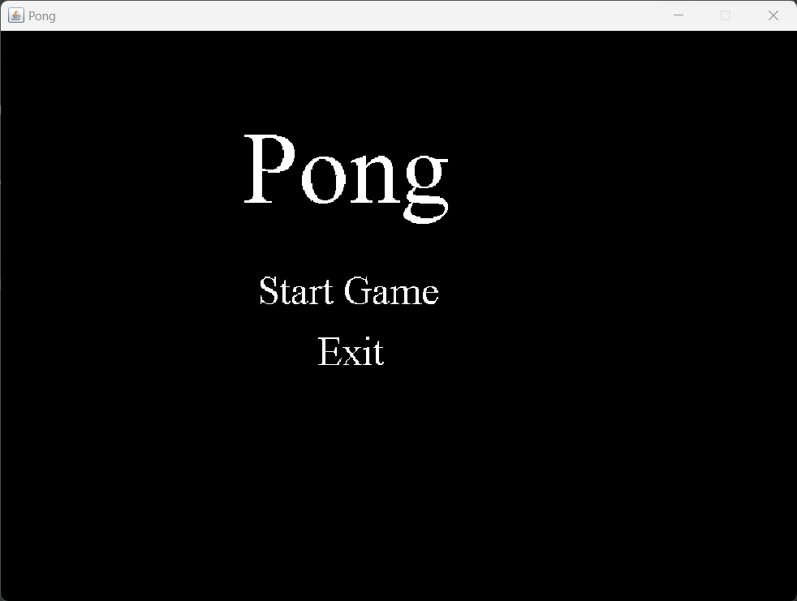
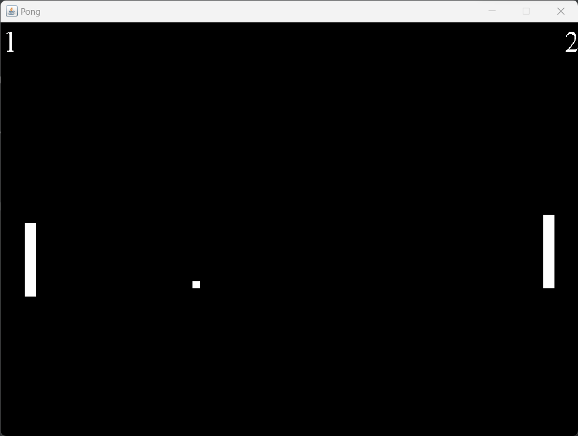

# Java-Pong
Java Pong Game

<h3>Main Menu</h3>

<h3>Gameplay</h3>

1-Creating the Window
<ul>
    <li>Create Window using JFrame methods in <code>Window.java</code>.</li>
    <li>Create <code>Constants.java</code> to hold constant values.</li>
    <li>Create thread to run window.</li>
</ul>

2-The Game Loop
<ul>
    <li>In <code>Window.java</code>, we want to call <code>update</code> method every frame of our game and we want to pass in how long it took to do the last frame.</li>
    <li>Create <code>Time.java</code> to call Java's system get nano time to get the best time measurement on the OS we are running on.</li>
    <li>Added code to <code>run</code> and <code>update</code> methods to check the frames per second(fps).</li>
    <li>Import <code>Graphics2D</code> to create Graphics <code>g2</code> in <code>Window</code> method and update g2 in <code>update</code> method.</li>
</ul>

3-Handling User Input
<ul>
    <li>Create new class <code>KL</code> to implement KeyListener. Create methods <code>keyPressed</code>, <code>keyReleased</code> and <code>isKeyPressed</code>.</li>
    <li>Initialize new KL <code>keyListener</code> in Window class and use using <code>this.addKeyListener(keyListener)</code> in <code>public Window</code>.</li>
    <li>Add <code>keyListener</code> to listen for <code>KeyEvents</code> in <code>update</code> method.</li>
</ul>

4-Drawing the Player
<ul>
    <li>Create paddles and ball on the screen and will use this to detect collisions.</li>
    <li>Create class <code>Rect</code> for paddle and ball.</li>
    <li>Create new Constants for width/height/color for paddle/ball and padding.</li>
    <li>Initialize playerOne, ai, and ball as new <code>Rects</code> in <code>public Window</code>. Draw them in <code>update</code> method.</li>
</ul>

5-Making the Player Controller
<ul>
    <li>Implement the PlayerController to move the player and ai.</li>
    <li>Create new class <code>PlayerController</code>.</li>
    <li>Initialize <code>PlayerController</code> in <code>Window</code>.</li>
    <li>For smoother gameplay:
        <ul>
            <li>Changed all int values to double values.</li>
            <li>In <code>update</code> method, create an image <code>dbImage</code> for double buffer image. Then create a Graphics <code>dbg</code> for double buffer graphics.</li>
            <li>We will draw everything to this dbg which will not be displayed to the user.</li>
            <li>Then we're going to return this dbg to our <code>draw</code> method and draw the image to the screen. </li>
            <li>This way everything gets drawn incrementally on an off screen and then we swap buffers and show this buffer to the user.</li>
        </ul>
    </li>
    <li>Create new constants <code>TOOLBAR_HEIGHT</code> and <code>INSETS_BOTTOM</code> to prevent paddles going off screen. </li>
    <li>Create new constant <code>PADDLE_SPEED</code> for use in paddle movement.</li>
</ul>

6a - Moving the Ball
<ul>
    <li>Create new class <code>Ball</code> to handle Ball movement and collisions.</li>
    <li>In <code>Window.java</code>, initialize <code>Ball ball</code> and make sure it is updated in <code>update</code> method. Update and draw ball.</li>
</ul>

6-AI Controller
<ul>
    <li>In <code>PlayerController</code>,create a constructor for the AI that doesn't use the keyListener.</li>
    <li>Create new class <code>AIController</code>. AI paddle will respond based on the ball being below or above the AI paddle.</li>
    <li>In <code>Window</code>, initialize a <code>AIController</code> for <code>aiController</code>. Update and draw ai.</li>
</ul>

7-Keeping Score
<ul>
    <li>Create new class <code>Text.java</code>. </li>
    <li>Create new constants for x/y positions for scores and score font size.</li>
    <li>In <code>Window</code>, create and initialize <code>Text leftScoreText</code>/<code>rightScoreText</code>.</li>
    <li>In <code>Ball</code>, add <code>Text leftScoreText</code>/<code>rightScoreText</code> as arguments to <code>Ball</code>.</li>
    <li>Create new constant for win score and add code to determine win condition after ball passes either paddle.</li>
</ul>

8-MainMenu
<ul>
    <li>Create new class MainMenu. Create <code>Texts</code> for <code>startGame</code>, <code>exitGame</code> and <code>pongTitle</code> and draw them.</li>
    <li>Create new class <code>ML</code> for Mouse Listener to listen for mouse hover/click on the texts. Create and initialize <code>ML</code> in <code>MainMenu</code>.</li>
    <li>In <code>update</code> in <code>MainMenu</code> add code to change color when hovering over startGame and exitGame.</li>
    <li>Update <code>Main</code> for GameWindow(1) or MainMenu(0) states. Create method <code>changeState</code> to change states. </li>
    <li>In <code>MainMenu</code>, update mouse hover with <code>Main.changeState(1);</code>. Add <code>this.dispose();</code> to <code>run</code> method when game state is changed to close MainMenu window.</li>
    <li>In <code>Window</code>, add <code>this.dispose();</code> to <code>run</code> method when game state is changed to close gameWindow.</li>
    <li>In <code>Ball</code>, change the game state to 2 when player/ai wins and kill all threads.</li>
</ul>
